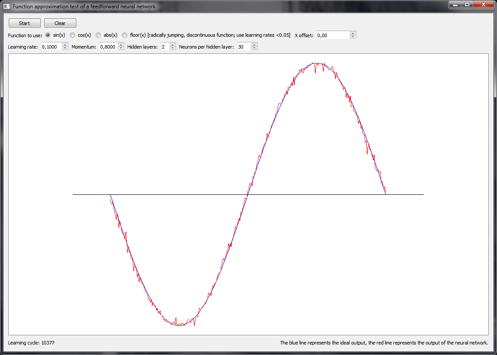

# FFNNTFunctApprTest
A Qt program written in C++ capable of approximating continuous functions (sin(x), cos(x), ...) using a feedforward neural network with configurable hyperparameters.

## Download
Download link: [Win32 binary](https://github.com/Extender/FFNNTFunctApprTest/raw/master/bin/fnntfunctapprtest-v1.0-bin-win32.zip)

## Screenshot

